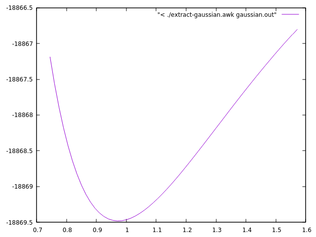
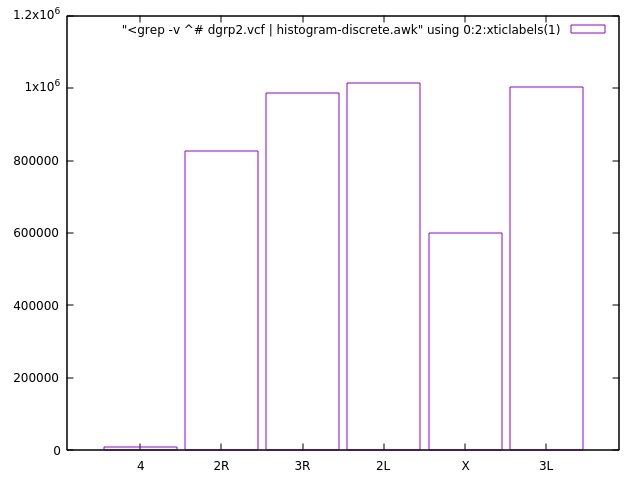

# 3.Shell we awk!

## Q: OK, I see this and that but really, why should I bother with awk?
<hr />
Indeed, why? Lets get back to our very first example with the coins.

``` text title="coins.txt"
gold     1    1986  USA                 American Eagle
gold     1    1908  Austria-Hungary     Franz Josef 100 Korona
silver  10    1981  USA                 ingot
gold     1    1984  Switzerland         ingot
gold     1    1979  RSA                 Krugerrand
gold     0.5  1981  RSA                 Krugerrand
gold     0.1  1986  PRC                 Panda - silver lined
silver   1    1986  USA                 Liberty dollar
gold     0.25 1986  USA                 Liberty 5-dollar piece
silver   0.5  1986  USA                 Liberty 50-cent piece
silver   1    1987  USA                 Constitution dollar
gold     0.25 1987  USA                 Constitution 5-dollar piece
gold     1    1988  Canada              Maple Leaf
```

Let's, just for a moment, assume that the file contains thousands of lines and your task is to summarize how many coins from each country you have in the file. 
You can do it in some spreadsheet software, you can write a program in C, C++, Fortran, Python, Perl - I know. You can use a helicopter to travel pretty much everywhere, but are you going to use it for a visit to the nearby grocery store? 

So, perhaps **grep** + **wc** is a good start. 

``` bash
$ grep USA coins.txt | wc -l
```

This will give you the number of coins (lines) that have USA in the description. Then you go over all possible countries that are in the file but how many? Do you create a list of all countries and then run a loop over it? Why not give it to awk and use some associative [arrays](http://www.gnu.org/software/gawk/manual/gawk.html#Arrays) for this purpose?

``` awk title="count.awk"
#!/usr/bin/awk -f

{ data[$4]= data[$4] + 1 }

END {
  for (i in data) print "Country: " i " count: " data[i]
}
```

This is written in a script file, but if you insist here is the one line equivalent.

``` awk
$ awk '{data[$4]++} END {for (i in data) print "Country: " i " count: " data[i]}' coins.txt
```

Note that we neither defined the names of the countries nor their number in advance... The only restriction is that the name of the country should be a single word.

So, on every line `#!awk {data[$4]= data[$4]+1}` will address the element with the value of the 4^th^ column in the array `data` and will be increased by one. No need to declare the array in advance, no need to pre-allocate the size or to dynamically allocate the array... Everything is done behind the scene for your convenience... and the price to pay is... speed. In this particular case (with the thousands line file) the speed is not a problem.

??? "Exercises"
    - Can you change the program so that it will count how many gold and silver coins there are? ...how many coins for each year...
    - This was a small file. Let's try something large. Look at the content of the `dgrp2.vcf` file you have downloaded (look in the provided instructions on how to download it). Here is a description of the [VCF](http://genome.ucsc.edu/FAQ/FAQformat.html#format10.1) format. **Find out how many different chromosomes contains the file**. The relevant information is in the first column. What other information you could easily extract? - data entries per chromosome, fractions...

## Well, coins, countries - anything else?
---
Hm, if you work regularly with unformatted text files, like output from some programs, where the numbers are mixed with a complimentary text - then keep reading...         
Let's use the output from the Gaussian code as an example (*something from my research*).

``` text hl_lines="3 9 21" title="gaussian.out"
  . . . ( more than 1 000 lines ) . . .
  ---------------------------------------------------------------------
                      Distance matrix (angstroms):
                    1          2          3          4          5
     1  O    0.000000
     2  H    0.963063   0.000000
     3  H    3.055408   2.200353   0.000000
     4  H    3.599651   2.649467   1.360343   0.000000
     5  O    2.921061   1.978989   0.745120   0.995689   0.000000
     6  H    1.853252   1.916060   3.229967   3.940127   3.023829
     7  H    3.373977   3.518394   4.584225   5.275136   4.356355
     8  O    2.872140   2.799938   3.649823   4.343776   3.416579
     9  H    3.899854   3.574193   2.560758   3.901261   3.205196
  . . . ( more than 1 000 lines ) . . .
 Hexadecapole moment (field-independent basis, Debye-Ang**3):
 XXXX=          -2970.5127 YYYY=          -1148.8478 ZZZZ=          -1274.6533 XXXY=           -394.6318
 XXXZ=            676.4844 YYYX=           -298.0473 YYYZ=             48.9948 ZZZX=            302.4536
 ZZZY=            111.2988 XXYY=           -793.1298 XXZZ=           -808.1397 YYZZ=           -454.2615
 XXYZ=            -73.3495 YYXZ=             82.5166 ZZXY=           -127.7147
 N-N= 4.131583513295D+02 E-N=-2.289173820990D+03  KE= 6.050114478748D+02
 Counterpoise: corrected energy =    -693.356401084648
 Counterpoise: BSSE energy =       0.003357515766

 Test job not archived.
 1\1\NSC-NEOLITH\SP\RB3LYP\6-31++G(d,p)\H17O9(1-)\X_PAVMI\23-Mar-2012\0
 \\#B3LYP/6-31++G(d,p) Counterpoise=2 Charge SCF=Tight NoSymm\\OH- in H
 2O,std. LJ params. for H2O, MC/QM\\-1,1\O,0,0.,0.,0.\H,0,-0.836605,-0.
  . . . ( more lines ) . . .
```
The numbers that I am interested in are in bold. There are **56 such pairs** in the whole file. I need them tabulated in simple, two-column file that is easy to read, analyze and plot. Here I will not discuss other solutions. Instead, here is a possible awk solution:

``` awk title="extract-gaussian.awk"
#!/usr/bin/awk -f
BEGIN { AU2eV= 27.211383 }
/Distance matrix/ {getline; getline; getline; getline; getline; getline; rOH= $5}
/Counterpoise: corrected energy/ { printf "%.12f %.6f\n", rOH, $5*AU2eV }
```

Here is the result:
``` hl_lines="1"
./extract-gaussian.awk gaussian.out

0.745120000000 -18867.186585
0.760120000000 -18867.562399
0.775121000000 -18867.891626
0.790119000000 -18868.178646
0.805120000000 -18868.427531
0.820119000000 -18868.641859
0.835121000000 -18868.824992
0.850121000000 -18868.979881
0.865120000000 -18869.109227
0.880121000000 -18869.215504
0.895120000000 -18869.300920
0.910121000000 -18869.367515
0.925120000000 -18869.417119
0.940121000000 -18869.451414
0.955119000000 -18869.471908
0.970120000000 -18869.479979
0.985120000000 -18869.476868
1.000120000000 -18869.463711
1.015120000000 -18869.441546
1.030121000000 -18869.411316
. . .
```

`#!awk BEGIN{ AU2eV= 27.211383 }` simply defines a conversion factor from atomic units to eV.

`#!awk /Distance matrix/{getline; getline; getline; getline; getline; getline; rOH= $5}` will match lines with the specified criteria, skip 6 lines, then accumulate the 5th column in variable rOH - the distance between an O and an H in the molecule of interest.

`#!awk /Counterpoise: corrected energy/ { printf "%.12f %.6f\n", rOH, $5*AU2eV }` will match the other interesting line, then prints the collected earlier rOH and corresponding energy converted in eV.

Reading the resulting file is trivial in any programming language or plotting program.

Look at this alternative solution that uses a smart trick to advance 6 lines after the `#!awk /Distance matrix/` line 
??? "credits to Pavol Bauer, workshop 2017.01.13"

    ``` awk
    #!/usr/bin/awk -f
    BEGIN { AU2eV= 27.211383 }
    /Distance matrix/ {myNR=NR}
    NR==myNR+6        {rOH=$5}
    /Counterpoise: corrected energy/ { printf "%.12f %.6f\n", rOH, $5*AU2eV }
    ```
Other case studies that will be gradually collected for further inspiration.

??? "Exercises"
    - Can you modify the script to print a third column with values from the line `Counterpoise: BSSE energy =       0.003357515766` also converted in eV?

??? "gnuplot tips"
    Here is an example how you can quickly visualize the results with `gnuplot`, directly from the output of the script.
    ``` gnuplot title="$ gnuplot"
    plot "< ./extract-gaussian.awk gaussian.out" with lines
    ```
    

    Another example that visualizes the country distribution from the coins.txt data. Try to sort the output as earlier and plot on the fly.
    ``` gnuplot title="$ gnuplot"
    set boxwidth 0.9; plot [:][0:] "< ./count.awk coins.txt" using 0:4:xticlabels(2) with boxes
    ```
    

    Or visualizing the chromosome counting/distribution exercise... `histogram-discrete.awk` script is discussed [here](../Case_studies/Discrete_histogram).
    ``` gnuplot title="$ gnuplot"
    set boxwidth 0.9; plot [:][0:] "<grep -v ^# dgrp2.vcf | histogram-discrete.awk" using 0:2:xticlabels(1) with boxes
    ```
    