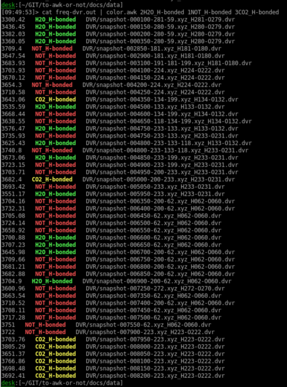

# Color output with custom keywords

There are few tools to highlight different language syntax with colors and they are excellent tools for what they are designed. 
Some time I would like to use my own keywords for highlighting and this always turns to be a difficult task.

Here is a small script that highlights provided keywords (or simple regular expressions) on the fly.
For convenience, I made it possible to choose between some predefined color schemes.

??? note "freq-dvr.out"
    ```
    3300.42   H2O_H-bonded   DVR/snapshot-000100-281-59.xyz_H281-O279.dvr
    3436.45   H2O_H-bonded   DVR/snapshot-000150-280-59.xyz_H280-O279.dvr
    3382.03   H2O_H-bonded   DVR/snapshot-000200-280-59.xyz_H280-O279.dvr
    3360.05   H2O_H-bonded   DVR/snapshot-000350-280-59.xyz_H280-O279.dvr
    3709.4   NOT_H-bonded   DVR/snapshot-002850-181.xyz_H181-O180.dvr
    3647.54   NOT_H-bonded   DVR/snapshot-002900-181.xyz_H181-O180.dvr
    3683.93   NOT_H-bonded   DVR/snapshot-003100-191-181-199.xyz_H181-O180.dvr
    3703.93   NOT_H-bonded   DVR/snapshot-004100-224.xyz_H224-O222.dvr
    3670.12   NOT_H-bonded   DVR/snapshot-004150-224.xyz_H224-O222.dvr
    3654.3   NOT_H-bonded   DVR/snapshot-004200-224.xyz_H224-O222.dvr
    3710.58   NOT_H-bonded   DVR/snapshot-004250-224.xyz_H224-O222.dvr
    3643.06   CO2_H-bonded   DVR/snapshot-004350-134-199.xyz_H134-O132.dvr
    3535.59   H2O_H-bonded   DVR/snapshot-004500-133.xyz_H133-O132.dvr
    3668.44   NOT_H-bonded   DVR/snapshot-004600-134-199.xyz_H134-O132.dvr
    3638.55   NOT_H-bonded   DVR/snapshot-004650-118-134-199.xyz_H134-O132.dvr
    3576.47   H2O_H-bonded   DVR/snapshot-004750-233-133.xyz_H133-O132.dvr
    3735.93   NOT_H-bonded   DVR/snapshot-004750-233-133.xyz_H233-O231.dvr
    3625.43   H2O_H-bonded   DVR/snapshot-004800-233-133-118.xyz_H133-O132.dvr
    3740.8   NOT_H-bonded   DVR/snapshot-004800-233-133-118.xyz_H233-O231.dvr
    3673.06   H2O_H-bonded   DVR/snapshot-004850-233-199.xyz_H233-O231.dvr
    3723.15   NOT_H-bonded   DVR/snapshot-004900-233-199.xyz_H233-O231.dvr
    3703.71   NOT_H-bonded   DVR/snapshot-004950-200-233.xyz_H233-O231.dvr
    3682.4   CO2_H-bonded   DVR/snapshot-005000-200-233.xyz_H233-O231.dvr
    3693.42   NOT_H-bonded   DVR/snapshot-005050-233.xyz_H233-O231.dvr
    3551.17   H2O_H-bonded   DVR/snapshot-005950-233.xyz_H233-O231.dvr
    3704.16   NOT_H-bonded   DVR/snapshot-006350-200-62.xyz_H062-O060.dvr
    3732.31   NOT_H-bonded   DVR/snapshot-006400-200-62.xyz_H062-O060.dvr
    3705.08   NOT_H-bonded   DVR/snapshot-006450-62.xyz_H062-O060.dvr
    3724.14   NOT_H-bonded   DVR/snapshot-006500-62.xyz_H062-O060.dvr
    3658.92   NOT_H-bonded   DVR/snapshot-006550-62.xyz_H062-O060.dvr
    3700.88   H2O_H-bonded   DVR/snapshot-006600-62.xyz_H062-O060.dvr
    3707.23   H2O_H-bonded   DVR/snapshot-006650-62.xyz_H062-O060.dvr
    3645.98   H2O_H-bonded   DVR/snapshot-006700-200-62.xyz_H062-O060.dvr
    3709.66   NOT_H-bonded   DVR/snapshot-006750-200-62.xyz_H062-O060.dvr
    3681.21   NOT_H-bonded   DVR/snapshot-006800-200-62.xyz_H062-O060.dvr
    3682.88   NOT_H-bonded   DVR/snapshot-006850-200-62.xyz_H062-O060.dvr
    3704.9   H2O_H-bonded   DVR/snapshot-006900-200-62.xyz_H062-O060.dvr
    3600.96   NOT_H-bonded   DVR/snapshot-007250-272.xyz_H272-O270.dvr
    3663.54   NOT_H-bonded   DVR/snapshot-007350-62.xyz_H062-O060.dvr
    3710.52   NOT_H-bonded   DVR/snapshot-007400-200-62.xyz_H062-O060.dvr
    3708.11   NOT_H-bonded   DVR/snapshot-007450-62.xyz_H062-O060.dvr
    3717.28   NOT_H-bonded   DVR/snapshot-007500-62.xyz_H062-O060.dvr
    3751   NOT_H-bonded   DVR/snapshot-007550-62.xyz_H062-O060.dvr
    3722   NOT_H-bonded   DVR/snapshot-007900-223.xyz_H223-O222.dvr
    3703.76   CO2_H-bonded   DVR/snapshot-007950-223.xyz_H223-O222.dvr
    3805.29   CO2_H-bonded   DVR/snapshot-008000-223.xyz_H223-O222.dvr
    3651.37   CO2_H-bonded   DVR/snapshot-008050-223.xyz_H223-O222.dvr
    3766.86   CO2_H-bonded   DVR/snapshot-008100-223.xyz_H223-O222.dvr
    3698.48   CO2_H-bonded   DVR/snapshot-008150-223.xyz_H223-O222.dvr
    3692.41   CO2_H-bonded   DVR/snapshot-008200-223.xyz_H223-O222.dvr
    ```
``` bash
$ cat freq-dvr.out | color.awk 2H2O_H-bonded 1NOT_H-bonded 3CO2_H-bonded
```




``` awk title="color.awk"
#!/usr/bin/awk -f
BEGIN{
  nARGC= ARGC; ARGC=1 # Trick the command line to ignore the files and use them as options

  c[0]= "\033[97;41m" # white-red
  c[1]= "\033[31;1m"  # red
  c[2]= "\033[32;1m"  # green
  c[3]= "\033[33;1m"  # yellow
  c[4]= "\033[34;1m"  # blue
  c[5]= "\033[35;1m"  # magenta
  c[6]= "\033[36;1m"  # cyan
  c[7]= "\033[93;41m" # yellow-red
  cn=   "\033[0m"     # reset
}

{
  for (i=1; i< nARGC; i++ ){
    ci= ARGV[i]+0 # color index
    m= ARGV[i]    # match string
    sub(ci,"",m)  # remove color index
    gsub(m, c[ci]"&"cn)  # insert color codes
  }
  print $0
}

```

The color scheme is selected by number before the matching string, which limits a bit the functionality, but it keeps the script simple...

Here is an alternative script that has some general keywords and matching criteria predefined. It is straight forward to add your own patterns or remove the unnecessary ones.

``` awk
#!/usr/bin/awk -f
BEGIN{
  c[0]= "\033[97;41m" # white-red
  c[1]= "\033[31;1m"  # red
  c[2]= "\033[32;1m"  # green
  c[3]= "\033[33;1m"  # yellow
  c[4]= "\033[34;1m"  # blue
  c[5]= "\033[35;1m"  # magenta
  c[6]= "\033[36;1m"  # cyan
  c[7]= "\033[93;41m" # yellow-red
  cn=   "\033[0m"     # reset
}

{
  gsub(/WARNING|Warning|warning/,                         c[2]"&"cn)  # Warning
  gsub(/ERROR|Error|error/,                               c[0]"&"cn)  # Error
  gsub(/FAIL|Fail|fail|FAILED|Failed|failed/,             c[0]"&"cn)  # Failed
  gsub(/([0-9]{1,3}\.){3}[0-9]{1,3}/,                     c[2]"&"cn)  # IP4 address
  gsub(/([0-9a-fA-F]{2}[:-]){5}[0-9a-fA-F]{2}/,           c[4]"&"cn)  # MAC
  gsub(/[A-Za-z0-9._%+-]+@[A-Za-z0-9.-]+\.[A-Za-z]{2,4}/, c[6]"&"cn)  # e-mail
  gsub(/https?:\/\/(www\.)?[-a-zA-Z0-9@:%._\+~#=]{1,256}\.[a-zA-Z0-9()]{1,6}([-a-zA-Z0-9()@:%_\+.~#?&//=]*)/, c[4]"&"cn)  # web address

  $0= gensub(/(^|[[ ]){1}(OK|Ok)([] ]|$){1}/,           "\\1"c[2]"\\2"cn"\\3",  "g") # OK - special case

  gsub(/[&@][A-Za-z_]+/,                                  c[3]"&"cn)  # @& 
  gsub(/^#SBATCH.*$/,                                     c[6]"&"cn)  # SBATCH
  gsub(/^#.*$/,                                           c[4]"&"cn)  # comment

  print $0
}
```
